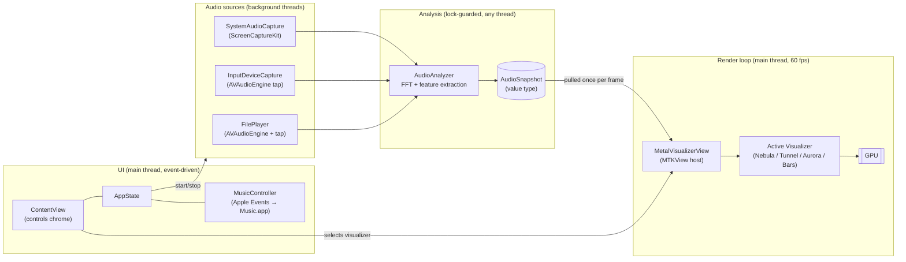
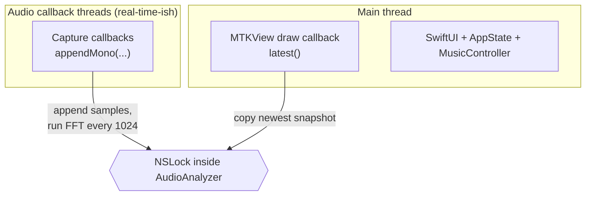
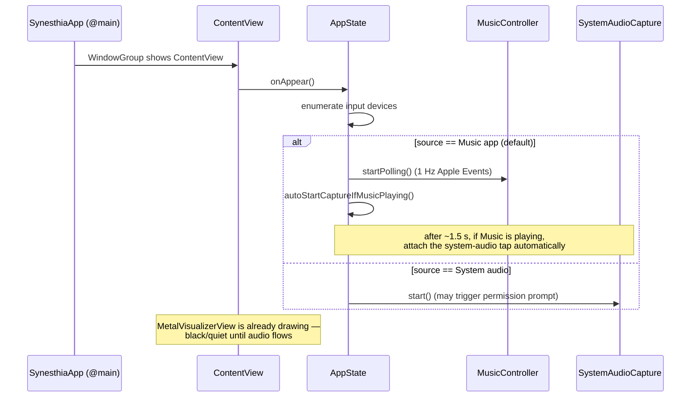

# Architecture

## The one-paragraph version

Audio arrives from one of four sources on background audio threads and is
funneled into a single analyzer, which continuously distills it into a small
value-type summary (`AudioSnapshot`). Sixty times a second, the render loop
_pulls_ the latest snapshot and hands it to the currently selected
visualizer, which draws a frame on the GPU. A thin SwiftUI layer floats on
top for controls, coordinated by one observable `AppState` object. The two
halves — audio→graphics and UI — touch only at well-defined points.

## Component map

The key asymmetry: **control flows down** (AppState starts and stops
engines), but **audio data is never pushed up**. The analyzer doesn't notify
anyone when new audio arrives; consumers come and get it. This is what keeps
the audio threads cheap and the UI free of 90-times-a-second updates.

## The main data types

| Type                                      | Role                                                                           | Mutability model                   |
| ----------------------------------------- | ------------------------------------------------------------------------------ | ---------------------------------- |
| `AudioSnapshot`                           | One frame of analyzed audio (spectrum bands, waveform, loudness, beat…)        | Immutable value copy per frame     |
| `VizUniforms`                             | The per-frame constants sent to the GPU (audio features + clock + user tuning) | Built fresh each frame             |
| `AppState`                                | Which source/visualizer is active; transport state; error banners              | `@Observable`, main actor          |
| `VisualizerDescriptor`                    | Static identity + options + factory for one visualizer                         | Immutable                          |
| `VisualizerTuning` / `VisualizerSettings` | Per-visualizer user settings, persisted to `UserDefaults`                      | `@Observable` store of value types |

## Threading model

macOS audio APIs deliver buffers on their own high-priority threads, and
those callbacks must do minimal work — no allocation, no UI. Synesthia's
answer is a single synchronization point:

- **`AudioAnalyzer`** is the only object shared across threads. It is
  `nonisolated` (excluded from the project's main-actor default) and guards
  all its state with one `NSLock`. Both sides hold the lock only briefly;
  the FFT itself (~a few hundred microseconds) runs under it, which is fine
  at these sizes.
- **Everything else is main-actor.** The Xcode project sets
  `SWIFT_DEFAULT_ACTOR_ISOLATION = MainActor`, so every type that doesn't
  opt out runs on the main thread. Background work has to opt out explicitly
  (`nonisolated`), which the capture callbacks in `AudioSources.swift` do.
- **The render loop is also on the main thread**: `MTKView` invokes its
  delegate's `draw(in:)` on the main run loop at display cadence. Drawing is
  cheap for the CPU — it just encodes commands; the GPU does the pixel work
  asynchronously.

## Why "pull", not "publish"?

A naïve design would make the analyzer `@Observable` and let SwiftUI react
to audio changes. That would invalidate SwiftUI views ~47 times per second
(every FFT hop) for data the _GPU_, not the view hierarchy, consumes. By
keeping audio data out of the observation system entirely:

- SwiftUI only re-renders for actual UI state changes (a track title, a
  button state).
- The render loop gets exactly one coherent `AudioSnapshot` per frame — no
  tearing, no partial updates — because the snapshot is copied under the
  lock as a plain value.
- The audio thread never blocks on anything slower than a short lock.

Only `AppState`, `MusicController`, and `VisualizerSettings` are
`@Observable`, and they hold _control_ state, which changes at human speed.

## Startup sequence

The visualizer never waits for audio: it renders from frame one, and the
analyzer's snapshot simply stays near zero (and decays toward silence)
until samples arrive.

## Where to go next

- How samples become a snapshot: [Audio pipeline](audio-pipeline.md)
- How a snapshot becomes pixels: [Rendering](rendering.md)
- The plugin contract: [Visualizers](visualizers.md)
- Permissions and platform glue: [macOS integration](macos-integration.md)
