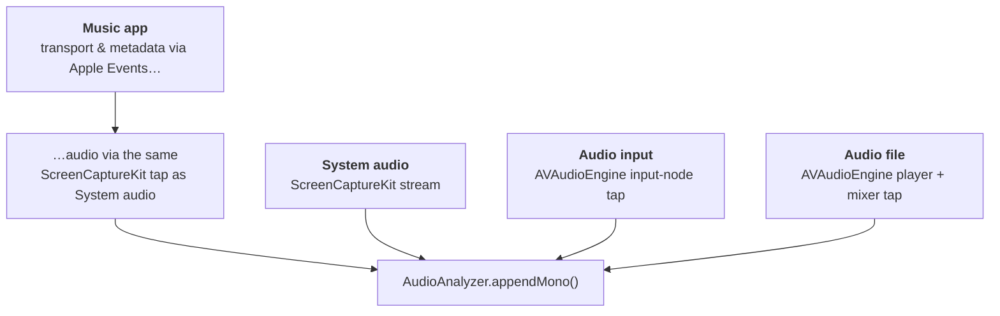
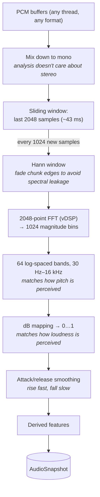
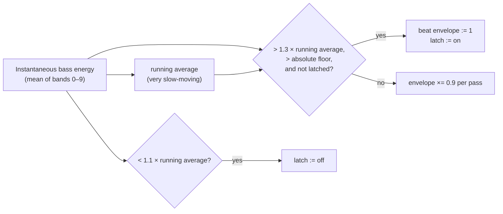

# The audio pipeline

This document covers the left half of the system: getting audio into the
app, and turning raw samples into the `AudioSnapshot` that every visualizer
consumes. Code: `Synesthia/Audio/AudioSources.swift` and
`Synesthia/Audio/AudioAnalyzer.swift`.

## A 60-second audio primer

Digital audio is a stream of **samples**: floating-point numbers (here,
-1…1) measuring the air-pressure wave, taken at a fixed **sample rate**
(typically 44,100 or 48,000 per second). A stereo stream has two such
channels. That's the _time domain_ — great for playback, useless for
questions like "how much bass is there right now?"

To answer those, you convert a short chunk of samples into the _frequency
domain_ with a **Fourier transform (FFT)**: out comes a set of **bins**,
each measuring how much of one frequency is present in the chunk. Low bins =
bass, high bins = treble. Synesthia runs an FFT about 47 times a second and
derives everything the visuals need from it.

## Part 1: the four sources

All four sources do the same thing in the end — call
`AudioAnalyzer.appendMono(from:)` with PCM buffers as they arrive — but they
get their audio in very different ways:

### System audio — `SystemAudioCapture`

macOS has no plain "record the system output" API. The sanctioned route is
**ScreenCaptureKit**, the _screen-recording_ framework, which can attach an
audio stream to a display capture. So the app configures a nominal screen
capture — 2×2 pixels at 5 fps, video frames discarded — purely to receive
the audio leg. This is why the permission users must grant is _"Screen &
System Audio Recording"_ even though no pixels are ever read.

Two non-obvious requirements (both learned the hard way; see `CLAUDE.md`):

- The audio must be extracted by _wrapping_ the sample buffer's memory
  (`withAudioBufferList` + `AVAudioPCMBuffer(bufferListNoCopy:)`). The
  copy-style API fails silently here.
- A `.screen` stream output must be registered even though it's discarded,
  or ScreenCaptureKit logs an error for every video frame.

`excludesCurrentProcessAudio = true` keeps Synesthia's own output (the file
player) out of the capture, preventing feedback.

### Music app

The **Music app** source is a hybrid: `MusicController` speaks AppleScript
to Music.app for _control and metadata_ (play/pause, track title, artwork —
see [macOS integration](macos-integration.md)), while the _audio itself_
comes through the same `SystemAudioCapture` tap as the System audio source,
because Music offers no direct audio stream.

### Audio input — `InputDeviceCapture`

Uses `AVAudioEngine`, Apple's node-graph audio framework. The engine's
`inputNode` represents a capture device, and an installed **tap** — a
callback handed every buffer flowing through a node — feeds the analyzer.
Nothing is connected downstream of the input, so the mic is analyzed but
never played back (no feedback squeal). Selecting a specific device means
setting the device ID on the input node's underlying Core Audio unit;
device _enumeration_ is done separately in `AudioInputDeviceList` with the
Core Audio C API.

### Audio file — `FilePlayer`

Also `AVAudioEngine`, but for playback: `player → mainMixerNode → speakers`,
with the analyzer's tap on the mixer — i.e. the visuals analyze exactly the
signal being played. The file loops forever: each scheduled pass's completion
handler schedules the next.

## Part 2: the analyzer

`AudioAnalyzer` is the single funnel. It's thread-safe (one `NSLock`), keeps
a sliding window of the most recent 2048 samples, and runs one analysis pass
every 1024 new samples — so consecutive FFTs overlap by 50%, giving ~47
snapshots per second at 48 kHz.

Each stage exists to correct a mismatch between what the FFT gives you and
what looks right on screen:

1. **Hann window.** An FFT treats its input chunk as if it looped forever;
   the abrupt edges of a raw chunk look like clicks and smear energy across
   the whole spectrum ("spectral leakage"). Multiplying the chunk by a
   raised-cosine fade fixes that.

2. **Log-spaced bands.** FFT bins are _linearly_ spaced (~23 Hz apart), but
   hearing is _logarithmic_ — the octave 60→120 Hz carries as much music as
   8k→16k Hz. The 64 band edges are placed geometrically so each band spans
   an equal frequency _ratio_. Without this, the entire bass line would
   occupy two bins and the top half of the display would be hiss.

3. **Decibel mapping.** Loudness perception is also logarithmic. Raw
   magnitudes would make everything but the loudest peak invisibly small;
   converting to dB and normalizing (-72 dB → 0, -6 dB → 1) spreads the
   useful dynamic range across 0…1.

4. **Attack/release smoothing.** Borrowed from audio compressors: a band
   rises toward a new higher value fast (65% per pass) but falls slowly
   (12% per pass). Fast attack keeps drum hits punchy; slow release stops
   the visuals from strobing between analysis passes.

### The derived features

Everything below is computed from the band array and packed into
`AudioSnapshot` (all values ≈ 0…1):

| Feature                   | What it is                                         | How it's computed                                   |
| ------------------------- | -------------------------------------------------- | --------------------------------------------------- |
| `bands[64]`               | The spectrum itself                                | Steps 1–4 above                                     |
| `waveform[256]`           | The raw wave shape, for oscilloscope-style visuals | Time-domain samples, downsampled                    |
| `level`                   | Overall loudness                                   | RMS of the window, dB-mapped                        |
| `bass` / `mid` / `treble` | Coarse register energies                           | Averages over band ranges                           |
| `components[8]`           | Finer named sub-bands (sub-bass … air)             | Averages over ranges mapped from fixed Hz edges     |
| `beat`                    | Kick-drum envelope: 1 on a hit, exponential decay  | Bass energy vs. its own running average (see below) |
| `trebleBeat`              | Hi-hat/snare-snap envelope; decays faster          | Same scheme over the top bands                      |
| `flux`                    | "How much _new_ energy just arrived" — any onset   | Sum of positive per-band changes between passes     |
| `centroid`                | Spectral brightness (dark ↔ airy)                  | Energy-weighted mean band index                     |

### Beat detection

The beat detector is deliberately simple and works well for rhythmic music:

Comparing against a _running average_ rather than a fixed threshold makes it
self-calibrating across quiet and loud tracks; the absolute floor stops
silence from triggering. The output is an **envelope**, not an event: it
jumps to 1 and decays exponentially, so a visualizer can simply multiply
things by `beat` and get a natural-looking pulse with free falloff.

The latch makes each detection **one-shot**: after firing, the detector is
disarmed until the energy falls back below 1.1× the average, and the
1.1–1.3 band is the hysteresis. Without it, a _held_ bass note riding the
trigger threshold (while the running average slowly catches up) re-fires
every few passes and the envelope sawtooths 1 → 0.8 → 1 at several hertz —
which edge-triggered consumers like Nebula's shockwave render as constant
shaking. Real kick patterns dip between hits, so they re-arm every time;
a sustained tone fires once and settles. `trebleBeat` uses the same latch.

### Silence behavior

If no samples arrive for 250 ms (source stopped, permission revoked),
`latest()` decays every value by elapsed wall time instead of freezing the
last loud frame on screen — the visuals gracefully dim to black at the same
speed whether the render loop pulls at 30 or 120 fps. Switching
sources calls `reset()`, clearing everything instantly so the previous
source's tail doesn't bleed into the new one.

## Design notes

- **Why a snapshot struct?** The render thread gets a _copy_ under the lock.
  After that, it can read all 300+ floats for the rest of the frame with no
  synchronization and total consistency (bands, beat, and waveform all from
  the same instant).
- **Why is the analyzer a singleton?** There is exactly one audio pipeline
  by design; sources are switched, not mixed. The capture engines all take
  the analyzer as an init parameter, so testing with a fresh instance
  remains possible.
- **Why vDSP?** Accelerate's vDSP routines (FFT, vector multiply, RMS) are
  SIMD-optimized; the whole analysis pass costs well under a millisecond,
  cheap enough to run under the lock on the audio thread.
