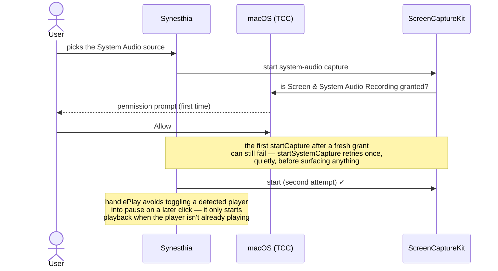
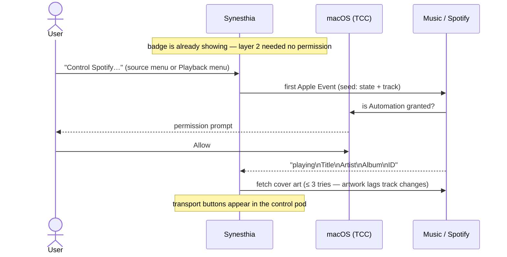

# macOS integration

Everything platform-specific: permissions, sandboxing, reading and driving
other apps' music playback, window chrome, and the Xcode project's non-obvious
configuration. If a feature "works but silently does nothing", the answer is
usually on this page.

## Permissions (TCC)

macOS gates access to sensitive capabilities behind **TCC** ("Transparency,
Consent, and Control") — the system that shows "_App X would like to…_"
prompts and remembers the answer in System Settings › Privacy & Security.
Denials usually surface as _errors or empty results, not crashes_, which is
why the app watches for specific error codes and shows hint banners.

Synesthia touches three TCC domains:

| Permission                      | Triggered by                                    | Needed for                   | On denial                                                 |
| ------------------------------- | ----------------------------------------------- | ---------------------------- | --------------------------------------------------------- |
| Screen & System Audio Recording | first `SCShareableContent`/`startCapture` call  | System audio source          | capture start throws; permission card over the canvas     |
| Microphone                      | `AVCaptureDevice.requestAccess`                 | Audio input source           | `microphoneDenied` error → permission card                |
| Automation → a music player     | first Apple Event, sent only on explicit opt-in | transport control, cover art | AppleScript error -1743; `automationDenied` flag → banner |

Note what is **not** in that table: knowing what is playing. That needs no
permission at all — see [Now playing](#now-playing-three-layers) below. The
Automation row is the only optional one, is never triggered without a direct
user command, and does not exist in the Mac App Store build.



## Sandbox and entitlements

The app is **sandboxed** (`ENABLE_APP_SANDBOX`), so every capability outside
the container must be declared in `Synesthia.entitlements` (repo root,
deliberately _outside_ the `Synesthia/` source folder so Xcode's synced
group doesn't treat it as a resource):

- `com.apple.security.device.audio-input` — microphone/line-in
- `com.apple.security.files.user-selected.read-only` — files chosen in the open panel
- `com.apple.security.files.bookmarks.app-scope` — so a chosen file survives relaunch

`Synesthia-Direct.entitlements` adds two more, and **only the direct-download
build has them**:

- `com.apple.security.automation.apple-events` — sending Apple Events at all
- `com.apple.security.temporary-exception.apple-events` for `com.apple.Music`
  and `com.spotify.client` — required because neither declares a
  scripting-targets group

Those two buy transport control and cover art, nothing more. The App Store
build ships neither, compiles out every line of AppleScript, and still shows
what you are listening to.

Sandbox violations are the classic cause of _silent_ failures (e.g. reading
a file outside the container just fails); check here before debugging logic.

## Now playing: three layers

"What is playing, and can we control it?" is not one feature but three, each
with its own permission cost. They are deliberately independent, so losing the
top layer costs nothing below it.

| Layer                 | Mechanism                                 | Permission            | Builds      |
| --------------------- | ----------------------------------------- | --------------------- | ----------- |
| 1. Hearing the audio  | ScreenCaptureKit system-audio tap         | Screen & System Audio | both        |
| 2. Knowing the track  | distributed notifications from the player | **none**              | both        |
| 3. Driving the player | Apple Events (`NSAppleScript`)            | Automation, opt-in    | Direct only |

There is deliberately **no separate "Music app" audio source**. There never
really was one: Music exposes no audio stream, so that source was already
listening through the same ScreenCaptureKit tap as System Audio — the only
difference was the metadata, which is now layer 2 and applies to every player.
Making it a source meant a user had to know which of two identical-sounding
options to pick. Stored settings naming `musicApp` migrate to `systemAudio`
(`AppState.migrated`).

### Layer 2: knowing the track, for free (`NowPlayingObserver`)

Media players broadcast their own state as **distributed notifications** — the
system-wide `NSNotification` bus, delivered by `distnoted`. The payload carries
title, artist, album and play state:

| Player  | Notification                                                         | Verified                    |
| ------- | -------------------------------------------------------------------- | --------------------------- |
| Music   | `com.apple.Music.playerInfo` (+ `com.apple.iTunes.playerInfo` alias) | macOS 26.5                  |
| Spotify | `com.spotify.client.PlaybackStateChanged`                            | Spotify desktop, macOS 26.5 |

This asks for **nothing**: no entitlement, no TCC prompt, no private API, no
polling. It is the reason the Mac App Store build can show a now-playing badge
at all, and it replaced a 1 Hz Apple Events poll that needed an entitlement the
store build could not have.

Four things worth knowing before touching it:

- **The sandbox does not strip `userInfo`.** This is widely claimed and is
  wrong. The documented restriction is on sandboxed _senders_ — a sandboxed app
  may not _post_ a `userInfo` dictionary. Receiving one is fine, verified on
  macOS 26.5 by running an ad-hoc-signed sandboxed binary (container created,
  so the sandbox was live) and watching full payloads arrive. If you are ever
  tempted to "fix" this by adding an entitlement, don't; there isn't one.
- **`suspensionBehavior: .deliverImmediately` is mandatory, not a tweak.** The
  default coalesces notifications while the app is inactive, and inactive is the
  _normal_ case here: the user is in Spotify picking the next song while
  Synesthia renders behind it. Immediate delivery is also the reason the code
  uses the selector-based `addObserver` — the block-based overload has no
  suspension argument, which is what `NotificationRelay` exists to bridge.
- **Key spellings are a dialect problem.** Music and Spotify agree on `Name`,
  `Artist`, `Album` and `Player State` but not on track identity
  (`PersistentID`, an `NSNumber`, vs `Track ID`, a `spotify:track:…` string).
  Each field takes the first key present rather than using a per-player map, so
  a new player row usually needs no parsing changes — and a dialect that isn't
  recognized yields no title, which is dropped, so a wrong guess is inert
  rather than visible.
- **A broadcast only fires on a transition.** Launching into already-playing
  music therefore shows no badge until the next track or play/pause. Layer 3
  closes that with `PlayerRemote.seed` where it exists; the store build simply
  picks the badge up a song late, which is why nothing else in the UI depends
  on it.

`.stopped` is kept distinct from a paused track: players post it when playback
ends altogether, and it means the badge should _go away_ rather than freeze on
the last song. Two players running at once is a real case (Music paused,
Spotify playing), so reports are ranked and whoever is actually playing wins
regardless of who reported last.

### Layer 3: driving the player (`PlayerRemote`)

Apple Events, macOS's decades-old inter-app scripting mechanism, driven from
Swift by executing AppleScript snippets via `NSAppleScript`. This is the only
way to get transport control or cover-art bytes, and it is the only part that
costs a permission.



The ordering is the point. Nothing sends an Apple Event until the user picks
"Control …" from a menu, so the Automation prompt always arrives one click
after the user asked for exactly that — never as a launch-time ambush. If it is
refused, the opt-in rolls back so the menu offers it again instead of leaving
the app claiming control it does not have. On later launches the opt-in is
remembered (`playerControlEnabled`), because the macOS grant persists too.

Quirks encoded in the implementation (all learned the hard way):

- **AppleScript constants don't coerce to text**: `player state as text`
  _throws_; the scripts map the constant to a string with `is playing`
  comparisons instead. From Swift this bug is invisible — the script just
  returns nil.
- **Every script is a complete literal per player**, not a template with the
  app name interpolated in. `scripts/build-appstore.sh` asserts that no
  `tell application "` string survives into the store binary; building the
  scripts by interpolation would delete the very string that assertion looks
  for.
- **Artwork**: `raw data of artwork 1` returns the original JPEG/PNG; `data` is
  a fallback. Artwork lags track changes, hence the retries, and it is filed
  under the track's `artworkKey` so a slow fetch can't land on the next song.
  **Spotify is deliberately excluded**: it exposes only a remote `artwork url`,
  and a network request per track is a privacy cost the palette tile avoids.
- **Scripts are compiled once** and cached per source string.
- **Error -1743** = automation denied (drives the hint banner); **-600** = app
  not running. Both are treated as "denied", and `isRunning` is checked first
  so asking a closed player a question can never launch it.

### The artwork tile

With no cover art — always in the store build, always for Spotify — the badge
does not draw an empty square. `ArtworkTile` fills it with a gradient sampled
from the _current visualizer's palette_, at an offset hashed from the album
name, with the player's Dock icon in the corner
(`NSRunningApplication.icon`, which needs no file access and so works in the
sandbox, unlike `NSWorkspace.icon(forFile:)` against `/Applications`).

The hash is hand-rolled FNV-1a rather than `String.hashValue`, because Swift
seeds its hasher per process: `hashValue` would give the same album a different
colour on every launch, and stability is the one property the tile most needs.
Seeding on the album rather than the track means playing straight through a
record doesn't strobe through hues.

## Window chrome (`WindowChrome.swift`)

SwiftUI's `.windowStyle(.hiddenTitleBar)` still leaves an opaque title-bar
strip. `ChromelessWindow` is an invisible `NSViewRepresentable` whose only
job is to reach the underlying AppKit `NSWindow` and strip it to a pane of
glass: full-size content view, transparent titlebar, hidden title text (that
is what actually removes the strip — the traffic-light buttons stay,
floating over the canvas), drag-anywhere (`isMovableByWindowBackground`),
and a minimum content size so the control pods can always lay out. The
window _title_ is still set (`navigationTitle`) so Mission Control and the
Window menu name the current track.

The floating controls themselves use the macOS 26 "Liquid Glass" material
(`.glassEffect`, behind the `chromeGlass` modifier in `ContentView.swift`,
which falls back to `.ultraThinMaterial` plus a hairline border and a drop
shadow below macOS 26) and auto-hide after 3 s of pointer stillness
(`onContinuousHover` only fires on actual movement, so a resting cursor
lets the timer run out; hovering a pod or having the options popover open
pins the chrome visible).

## Xcode project configuration

Settings that shape how you _work_ on this codebase — violating these is the
fastest way to break the build (details and history in `CLAUDE.md`):

- **Shader source lives in `Shaders.metal`**, compiled at build time now
  that the Metal Toolchain component (26.6) is installed. (It previously had
  to be a Swift string compiled at launch because the toolchain was missing;
  external plugins may still use that `makeLibrary(source:)` path.)
- **Never hand-edit file references in `project.pbxproj`.** The project uses
  a `PBXFileSystemSynchronizedRootGroup`: any `.swift` file created under
  `Synesthia/` is included automatically. (Editing _build settings_ in the
  pbxproj is fine.)
- **Main-actor by default.** `SWIFT_DEFAULT_ACTOR_ISOLATION = MainActor`
  project-wide: every unannotated type/function is main-actor isolated, so
  `@MainActor` annotations are redundant — instead, _background_ work must
  opt out explicitly (`nonisolated`), as `AudioAnalyzer` and the capture
  callbacks do. Swift language mode is 5, so violations are warnings, not
  errors — don't treat "it compiled" as proof of thread-safety.
- **No `Info.plist` file.** It's generated; usage-description strings live
  as `INFOPLIST_KEY_*` build settings.
- **No test target yet.** Adding one is the prerequisite for test work;
  `AudioAnalyzer` (band mapping, beat detection) is the natural first
  subject.

### Build & run

```bash
xcodebuild -project Synesthia.xcodeproj -scheme Synesthia -configuration Debug build && \
  open ~/Library/Developer/Xcode/DerivedData/Synesthia-*/Build/Products/Debug/Synesthia.app
```
