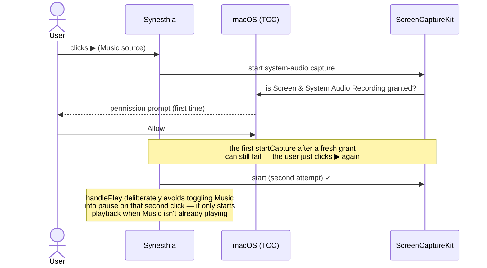
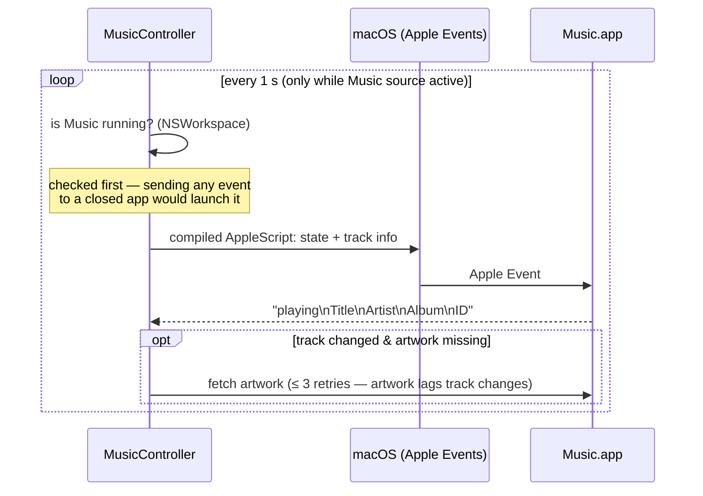

# macOS integration

Everything platform-specific: permissions, sandboxing, remote-controlling
the Music app, window chrome, and the Xcode project's non-obvious
configuration. If a feature "works but silently does nothing", the answer is
usually on this page.

## Permissions (TCC)

macOS gates access to sensitive capabilities behind **TCC** ("Transparency,
Consent, and Control") — the system that shows "_App X would like to…_"
prompts and remembers the answer in System Settings › Privacy & Security.
Denials usually surface as _errors or empty results, not crashes_, which is
why the app watches for specific error codes and shows hint banners.

Synesthia touches three TCC domains:

| Permission                      | Triggered by                                   | Needed for                                 | On denial                                                 |
| ------------------------------- | ---------------------------------------------- | ------------------------------------------ | --------------------------------------------------------- |
| Screen & System Audio Recording | first `SCShareableContent`/`startCapture` call | System audio + Music app sources           | capture start throws; banner points to System Settings    |
| Automation → Music              | first Apple Event sent to Music                | transport control, track metadata, artwork | AppleScript error -1743; `automationDenied` flag → banner |
| Microphone                      | `AVCaptureDevice.requestAccess`                | Audio input source                         | `microphoneDenied` error → banner                         |



## Sandbox and entitlements

The app is **sandboxed** (`ENABLE_APP_SANDBOX`), so every capability outside
the container must be declared in `Synesthia.entitlements` (repo root,
deliberately _outside_ the `Synesthia/` source folder so Xcode's synced
group doesn't treat it as a resource):

- `com.apple.security.device.audio-input` — microphone/line-in
- `com.apple.security.files.user-selected.read-only` — files chosen in the open panel
- `com.apple.security.assets.music.read-only` — music library
- `com.apple.security.automation.apple-events` — sending Apple Events at all
- `com.apple.security.temporary-exception.apple-events` for `com.apple.Music`
  — required because Music declares no scripting-targets groups; this
  exception would need review for App Store distribution

Sandbox violations are the classic cause of _silent_ failures (e.g. reading
a file outside the container just fails); check here before debugging logic.

## Controlling the Music app (`MusicController`)

There is no modern public API for "what is Music playing?" — the canonical
route is still **Apple Events**, macOS's decades-old inter-app scripting
mechanism, driven from Swift by executing AppleScript snippets via
`NSAppleScript`. Music pushes no notifications to third parties, so the app
**polls once a second** while the Music source is active:



Quirks encoded in the implementation (all learned the hard way):

- **AppleScript constants don't coerce to text**: `player state as text`
  _throws_; the script maps the constant to a string with `is playing`
  comparisons instead. From Swift this bug is invisible — the script just
  returns nil.
- **Artwork**: `raw data of artwork 1` returns the original JPEG/PNG;
  `data` is a fallback. Artwork lags track changes, hence the retry loop.
- **Scripts are compiled once** and cached per source string; the 1 Hz poll
  reuses the compiled object.
- **Error -1743** = automation denied (drives the settings-hint banner);
  **-600** = app not running.

## Window chrome (`WindowChrome.swift`)

SwiftUI's `.windowStyle(.hiddenTitleBar)` still leaves an opaque title-bar
strip. `ChromelessWindow` is an invisible `NSViewRepresentable` whose only
job is to reach the underlying AppKit `NSWindow` and strip it to a pane of
glass: full-size content view, transparent titlebar, hidden title text (that
is what actually removes the strip — the traffic-light buttons stay,
floating over the canvas), drag-anywhere (`isMovableByWindowBackground`),
and a minimum content size so the control pods can always lay out. The
window _title_ is still set (`navigationTitle`) so Mission Control and the
Window menu name the current track.

The floating controls themselves use the macOS 26 "Liquid Glass" material
(`.glassEffect`, behind the `chromeGlass` modifier in `ContentView.swift`,
which falls back to `.ultraThinMaterial` plus a hairline border and a drop
shadow below macOS 26) and auto-hide after 3 s of pointer stillness
(`onContinuousHover` only fires on actual movement, so a resting cursor
lets the timer run out; hovering a pod or having the options popover open
pins the chrome visible).

## Xcode project configuration

Settings that shape how you _work_ on this codebase — violating these is the
fastest way to break the build (details and history in `CLAUDE.md`):

- **Shader source lives in `Shaders.metal`**, compiled at build time now
  that the Metal Toolchain component (26.6) is installed. (It previously had
  to be a Swift string compiled at launch because the toolchain was missing;
  external plugins may still use that `makeLibrary(source:)` path.)
- **Never hand-edit file references in `project.pbxproj`.** The project uses
  a `PBXFileSystemSynchronizedRootGroup`: any `.swift` file created under
  `Synesthia/` is included automatically. (Editing _build settings_ in the
  pbxproj is fine.)
- **Main-actor by default.** `SWIFT_DEFAULT_ACTOR_ISOLATION = MainActor`
  project-wide: every unannotated type/function is main-actor isolated, so
  `@MainActor` annotations are redundant — instead, _background_ work must
  opt out explicitly (`nonisolated`), as `AudioAnalyzer` and the capture
  callbacks do. Swift language mode is 5, so violations are warnings, not
  errors — don't treat "it compiled" as proof of thread-safety.
- **No `Info.plist` file.** It's generated; usage-description strings live
  as `INFOPLIST_KEY_*` build settings.
- **No test target yet.** Adding one is the prerequisite for test work;
  `AudioAnalyzer` (band mapping, beat detection) is the natural first
  subject.

### Build & run

```bash
xcodebuild -project Synesthia.xcodeproj -scheme Synesthia -configuration Debug build && \
  open ~/Library/Developer/Xcode/DerivedData/Synesthia-*/Build/Products/Debug/Synesthia.app
```
