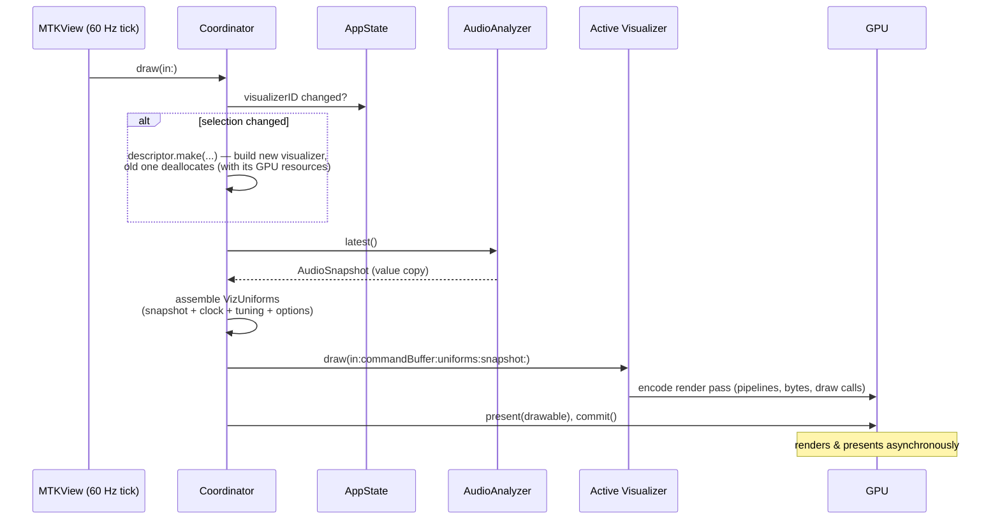
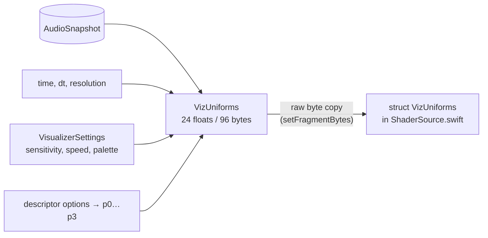

# Rendering

This document covers the right half of the system: how an `AudioSnapshot`
becomes pixels. Code: `Synesthia/Visualizers/MetalVisualizerView.swift`,
`VisualizerCore.swift`, and `ShaderSource.swift`.

## A 60-second GPU primer

**Metal** is Apple's low-level GPU API. The concepts that matter here:

- A **shader** is a small program that runs on the GPU, massively in
  parallel. A **vertex function** runs once per vertex of your geometry and
  outputs its screen position; a **fragment function** runs once per covered
  pixel and outputs its color.
- A **pipeline state** is a pre-compiled, validated bundle of (vertex
  function + fragment function + output format). Building one is expensive;
  you build it once and reuse it every frame.
- Each frame, the CPU **encodes** a list of GPU commands ("set this
  pipeline, use these bytes, draw 3 vertices") into a **command buffer**,
  then **commits** it. The GPU executes asynchronously; the CPU doesn't wait.
- **Uniforms** are small constants that are the same for every pixel of a
  draw — here, the audio features, the clock, and the user's settings.

Most of Synesthia's visuals use the "fullscreen shader" style (as
popularized by Shadertoy): draw one triangle that covers the whole screen,
and let the fragment function compute every pixel's color from scratch,
purely from its coordinates + time + audio. There is no scene, no meshes, no
cameras — the "3D" you see is math inside the fragment shader.

## The frame loop

`MetalVisualizerView` is an `NSViewRepresentable` — the SwiftUI wrapper for
an AppKit view — hosting an `MTKView` (MetalKit's view that owns a drawable
surface and ticks at display rate). Its `Coordinator` is the long-lived
delegate that owns the Metal objects and drives every frame:

Details worth knowing:

- **The view drives itself.** `isPaused = false`,
  `enableSetNeedsDisplay = false`: the MTKView ticks continuously from a
  display link rather than waiting for SwiftUI invalidation — the visuals
  animate even when no UI state changes.
- **`dt` is clamped** to 100 ms so a hiccup (debugger pause, window drag)
  doesn't make simulations take one giant step.
- **Visualizers are lazy.** Only the selected visualizer exists; switching
  builds the new one (pipelines, buffers) on the spot and lets ARC free the
  old one.

## Shaders are compiled at runtime

All shader code lives in **`ShaderSource.swift` as one big Metal Shading
Language (MSL) string**, compiled at launch with
`device.makeLibrary(source:)`. This is unusual — normally `.metal` files are
compiled at build time — and deliberate:

1. This development machine lacks the offline Metal toolchain (adding a
   `.metal` file breaks the build — see `CLAUDE.md`).
2. It keeps the door open for external visualizer plugins that ship their
   own shader source and compile it the same way at load time.

The cost is that shader errors surface at *launch* instead of at build time.
When editing the MSL string, compile-check it without launching the app:
build a small command-line harness that links `ShaderSource.swift` and calls
`makeLibrary` (a `main.swift` + `swiftc` two-liner).

## The CPU→GPU contract: `VizUniforms`

Each frame the coordinator packs everything a shader might want into a
`VizUniforms` struct:

The struct exists **twice**: once in Swift (`VisualizerCore.swift`) and once
in MSL (`ShaderSource.swift`). The GPU receives the Swift struct's raw bytes
and reinterprets them as the MSL struct, so *the two layouts must stay
byte-identical* — same fields, same order, currently 24 floats / 96 bytes.
Adding a field means updating both and keeping the sizes in sync; a mismatch
doesn't crash, it silently shifts every subsequent field into the wrong
shader variable.

Bulk data rides alongside the uniforms the same way: the 64-float band array
and (for Aurora) the 256-float waveform are passed with `setFragmentBytes`,
Metal's no-ceremony path for small per-draw data (< 4 KB).

## Drawing techniques used

These are the graphics idioms you'll meet in the shaders, all standard:

- **Fullscreen triangle** (`fullscreenVertex`): one triangle large enough
  that the screen is entirely inside it — cheaper and simpler than a
  two-triangle quad, and the vertices are generated from the vertex index,
  so no vertex buffer exists at all.
- **Cosine palettes** (`cosPalette`): `a + b·cos(2π(c·t + d))` per RGB
  channel turns one scalar into a smooth, cyclic gradient from four
  coefficient vectors. The five palettes are just five coefficient sets,
  mirrored on the CPU in `Palettes.color` for CPU-colored particles and the
  options-panel swatches — keep the two in sync.
- **Value noise / fBm** (`vnoise`, `fbm`): smoothly interpolated random
  values, then several octaves of it summed. The standard recipe for smoke,
  haze, and clouds.
- **Point sprites** (Nebula): the GPU can rasterize a single vertex as a
  screen-aligned square (`point_size`); the fragment shader shades a
  Gaussian falloff to turn the square into a soft glowing dot.
- **Additive blending** (Nebula's particles): fragments are *added* to the
  framebuffer instead of replacing it, so overlapping particles brighten
  like overlapping lights. Configured in `makeRenderPipeline`.
- **Reinhard tone mapping** (`c/(1+c)`): all that additive glow can exceed
  1.0; this rolls it smoothly back into displayable range instead of
  clipping to flat white.

## Where the pixels come from, per visualizer

| Visualizer | CPU work per frame | GPU passes |
|---|---|---|
| Spectrum Tunnel | none (just uniforms) | 1 fullscreen fragment shader |
| Aurora | none (just uniforms) | 1 fullscreen fragment shader |
| Nebula | simulate ≤ 4096 particles, write to shared buffer | fullscreen background + additive point sprites |

See [Visualizers](visualizers.md) for how each one turns audio into imagery.
