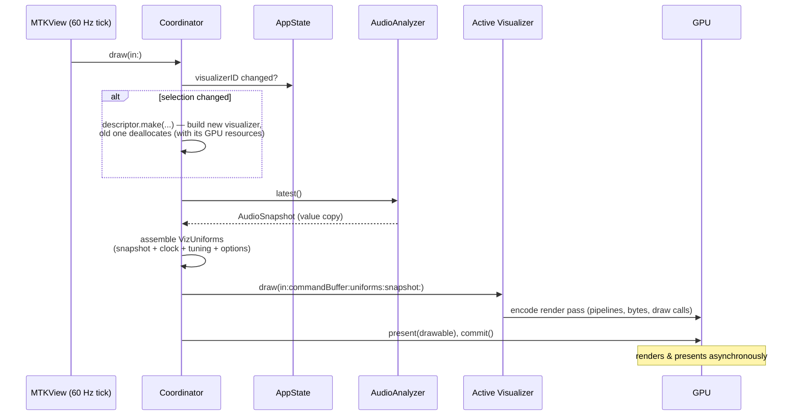
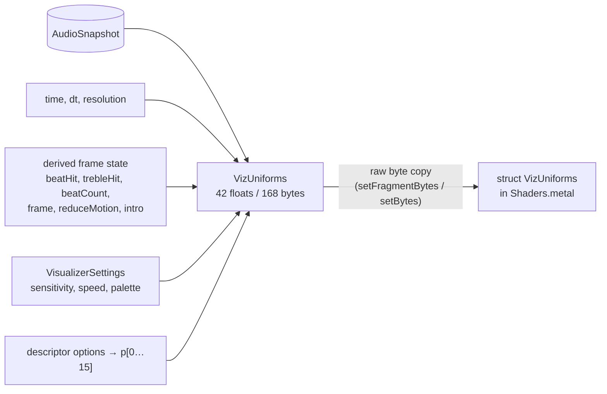
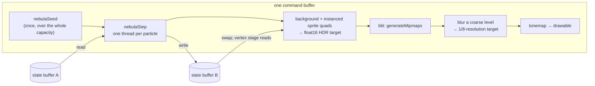

# Rendering

This document covers the right half of the system: how an `AudioSnapshot`
becomes pixels. Code: `Synesthia/Visualizers/MetalVisualizerView.swift`,
`VisualizerCore.swift`, and `Shaders.metal`.

## A 60-second GPU primer

**Metal** is Apple's low-level GPU API. The concepts that matter here:

- A **shader** is a small program that runs on the GPU, massively in
  parallel. A **vertex function** runs once per vertex of your geometry and
  outputs its screen position; a **fragment function** runs once per covered
  pixel and outputs its color.
- A **pipeline state** is a pre-compiled, validated bundle of (vertex
  function + fragment function + output format). Building one is expensive;
  you build it once and reuse it every frame.
- Each frame, the CPU **encodes** a list of GPU commands ("set this
  pipeline, use these bytes, draw 3 vertices") into a **command buffer**,
  then **commits** it. The GPU executes asynchronously; the CPU doesn't wait.
- **Uniforms** are small constants that are the same for every pixel of a
  draw — here, the audio features, the clock, and the user's settings.

Most of Synesthia's visuals use the "fullscreen shader" style (as
popularized by Shadertoy): draw one triangle that covers the whole screen,
and let the fragment function compute every pixel's color from scratch,
purely from its coordinates + time + audio. There is no scene, no meshes, no
cameras — the "3D" you see is math inside the fragment shader.

## The frame loop

`MetalVisualizerView` is an `NSViewRepresentable` — the SwiftUI wrapper for
an AppKit view — hosting an `MTKView` (MetalKit's view that owns a drawable
surface and ticks at display rate). Its `Coordinator` is the long-lived
delegate that owns the Metal objects and drives every frame:

Details worth knowing:

- **The view drives itself.** `isPaused = false`,
  `enableSetNeedsDisplay = false`: the MTKView ticks continuously from a
  display link rather than waiting for SwiftUI invalidation — the visuals
  animate even when no UI state changes.
- **Resolution adapts to GPU load** (dynamic resolution scaling, the same
  trick console engines use). Every command buffer reports its measured GPU
  time via `addCompletedHandler`; every half second the coordinator compares
  the average against the frame budget (1 / `preferredFramesPerSecond`) and
  steps the drawable along a 50–100%-of-native ladder — down when over 85%
  of budget, up when the predicted cost (area ratio × average) fits under
  60%, the gap being the hysteresis. `autoResizeDrawable` is off; the
  coordinator owns `drawableSize`, and Core Animation scales the smaller
  drawable up to the window. Fragment cost here is strictly per-pixel (the
  tunnel sphere-traces 60 noise-laden steps for every one), so a 5K
  fullscreen frame that would otherwise stutter instead renders at reduced
  resolution and holds the display's full frame rate — soft, glowing
  imagery upscales invisibly; dropped frames never do.
- **`dt` is clamped** to 100 ms so a hiccup (debugger pause, window drag)
  doesn't make simulations take one giant step.
- **Visualizers are lazy.** Only the selected visualizer exists; switching
  builds the new one (pipelines, buffers) on the spot and lets ARC free the
  old one.

## Where shaders live

All shader code is in **`Shaders.metal`**, written in the Metal Shading
Language (MSL — a C++ dialect). Xcode compiles it at build time into the
app's **default library** (`default.metallib` inside the bundle), which the
coordinator loads with `device.makeDefaultLibrary()`. Shader errors
therefore surface as ordinary build errors, and launch pays no
shader-compilation cost.

Historical note: the shaders used to live in a Swift string compiled at
launch with `device.makeLibrary(source:)`, because this machine lacked the
offline Metal toolchain. That runtime-compilation path is still the intended
mechanism for future _external_ visualizer plugins, which would ship their
own MSL source and compile it at load time.

## The CPU→GPU contract: `VizUniforms`

Each frame the coordinator packs everything a shader might want into a
`VizUniforms` struct:

The struct exists **twice**: once in Swift (`VisualizerCore.swift`) and once
in MSL (`Shaders.metal`). The GPU receives the Swift struct's raw bytes
and reinterprets them as the MSL struct, so _the two layouts must stay
byte-identical_ — same fields, same order, currently 42 floats / 168 bytes.
A mismatch doesn't crash: it silently shifts every subsequent field into the
wrong shader variable, which reads as a visualizer that has gone inexplicably
wrong. **Both sides therefore assert the layout**: MSL has
`static_assert(sizeof(VizUniforms) == 168)`, and `VizUniformsTests` pins the
Swift size, every field's offset, and the contiguity of the option block. A
one-sided edit fails the build or the test suite.

Growing the struct is the supported way to give every visualizer a new input.
Two rules: **append at the end**, and update the byte count in both files and
the test. The option block is the exception — it has to stay contiguous,
because MSL declares it as `float p[16]` and _indexes_ it:

- Sixteen slots rather than eight, because a compute visualizer wants more
  knobs than a fragment shader does (Nebula uses ten).
- Indexable rather than named, because a generic host for data-only plugins
  (see [roadmap](roadmap.md)) has to map a manifest's declared options onto
  slots whose meaning it doesn't know. `VizUniforms.parameterCount` is the one
  number the host, the docs, and the tests all read.
- Each visualizer names its own slots at the top of its shader section
  (`constant int kNebulaTurbulence = 3;`), so shader bodies say
  `u.p[kNebulaTurbulence]` instead of `u.p[3]` plus a comment.

Six fields carry **state the host derives once** rather than making every
visualizer redo it. The important pair is `beatHit`/`trebleHit`: `beat` and
`trebleBeat` are envelopes that decay smoothly, so nothing downstream can tell
"loud-ish" from "a kick landed on _this_ frame" — and an impulse in a
simulation has to be applied on exactly one frame. Detecting the rising edge
needs the previous frame's value, which the host has and a GPU kernel does not.
`beatCount` and `frame` are free clocks, `reduceMotion` lets an effect with no
audio feature to damp (a particle sim's turbulence) tone itself down, and
`intro` ramps 0 → 1 after a visualizer is built so a switch can fade in instead
of popping.

Bulk data rides alongside the uniforms the same way: the 64-float band array
and the 256-float waveform are passed with `setFragmentBytes` / `setBytes`,
Metal's no-ceremony path for small per-draw data (< 4 KB).

## GPU compute: simulation without the CPU

Most of the visualizers only ever draw. Nebula also **simulates**, and it does
that in a compute pass — a shader that runs over a grid of threads instead of
over triangles and pixels, reading and writing GPU memory. `Visualizer.draw`
receives the `MTLCommandBuffer` itself, so a compute pass is just one more
encoder in the same frame; `makeComputePipeline` builds the pipeline exactly as
`makeRenderPipeline` builds a render one.

`GPUParticleSystem` (`ParticleSystem.swift`) is the reusable half: it owns the
buffers, the ping-pong, the dispatch sizing and the binding convention, while
the visualizer owns the state layout and the two kernels. A flocking or fluid
visualizer would supply a different layout and different kernels and reuse the
rest.

What it buys, and why the CPU version couldn't:

- **~100k particles instead of ~4k.** The old simulation was a serial Swift
  loop on the render thread; every particle cost main-thread time _inside_ the
  frame. 100k particles are 100k independent GPU threads and cost the render
  thread one dispatch.
- **Device-private memory.** With no CPU writes the buffers can be
  `.storageModePrivate` — the fastest memory the GPU has, and unreachable from
  the CPU by construction. The old shared buffers had to be triple-buffered
  behind a semaphore so the CPU couldn't overwrite a frame the GPU was still
  reading; all of that is gone.
- **No CPU mirrors.** Nebula's body-orbit function used to exist in both Swift
  and MSL with a "keep these in sync" comment. The kernel and the background
  shader now call the same MSL function.

Two conventions worth knowing:

- **Buffer indices are fixed**, so different visualizers' kernels read the same
  way and the scaffolding can bind the shared ones itself:
  `0` state in (read-only), `1` state out, `2` `VizUniforms`, `3` bands,
  `4` waveform, `5`+ the visualizer's own. See `GPUParticleSystem.Binding`.
- **The step kernel reads one buffer and writes the other**, then they swap.
  Nebula's particles only read their own slot, so it could update in place — but
  read-only-in/write-only-out is the shape any neighbor-reading kernel
  (flocking, SPH) requires, and it costs one extra buffer. Both are seeded over
  the full capacity on the first step, so every slot holds valid state even
  before the Density control reaches it.

Dispatch uses `dispatchThreads` rather than `dispatchThreadgroups`, which lets
Metal size the ragged last threadgroup itself — so the kernel needs no bounds
check and never runs on a particle that doesn't exist.

## Drawing techniques used

These are the graphics idioms you'll meet in the shaders, all standard:

- **Fullscreen triangle** (`fullscreenVertex`): one triangle large enough
  that the screen is entirely inside it — cheaper and simpler than a
  two-triangle quad, and the vertices are generated from the vertex index,
  so no vertex buffer exists at all.
- **Cosine palettes** (`cosPalette`): `a + b·cos(2π(c·t + d))` per RGB
  channel turns one scalar into a smooth, cyclic gradient from four
  coefficient vectors. The five palettes are just five coefficient sets,
  mirrored on the CPU in `Palettes.color` for CPU-colored particles and the
  options-panel swatches — keep the two in sync.
- **Value noise / fBm** (`vnoise`, `fbm`): smoothly interpolated random
  values, then several octaves of it summed. The standard recipe for smoke,
  haze, and clouds.
- **Instanced sprite quads** (Nebula): one four-vertex quad per particle,
  corners generated from the vertex index, positioned by the vertex shader
  reading the simulation buffer directly — no vertex buffer, no per-particle
  draw call. Metal _can_ rasterize a single vertex as a screen-aligned square
  (`point_size`, which is what Nebula used to do), but a point sprite is always
  axis-aligned and capped at a device-dependent size; a quad can be scaled and
  **oriented**, which is what lets a particle stretch along its own velocity
  into a motion-blur streak.
- **Additive blending** (Nebula's particles): fragments are _added_ to the
  framebuffer instead of replacing it, so overlapping particles brighten
  like overlapping lights. Configured in `makeRenderPipeline`.
- **Divergence-free flow** (Nebula's turbulence): each component of the field
  depends only on the _other_ two axes, which makes its divergence exactly zero
  (the Arnold–Beltrami–Childress family). Incompressibility is the point — a
  field with sinks vacuums the whole cloud into a few knots within seconds,
  while this one shears it into filaments and keeps them moving, for a dozen
  sin/cos rather than the two dozen noise fetches a curl-of-noise field costs.
- **Bloom off the mip chain** (Nebula): `generateMipmaps` is a blit, and a mip
  chain is most of a bloom pyramid — but only the downsample half. Sampling a
  coarse level and stretching it back to full screen shows the level's own
  bilinear tent as 128-pixel blocks, and hiding that with a few offset taps just
  makes the taps visible as crosses (both were built and thrown away). The fix
  is to **blur in coarse space**: one pass takes a 5×5 Gaussian of level 4 into
  a 1/8-resolution target, and the tonemap samples _that_ bilinearly. A smooth
  image stays smooth at any magnification.
- **Reinhard tone mapping** (`c/(1+c)`): all that additive glow can exceed
  1.0; this rolls it smoothly back into displayable range instead of
  clipping to flat white.

## Where the pixels come from, per visualizer

| Visualizer      | CPU work per frame              | GPU passes                                                                                     |
| --------------- | ------------------------------- | ---------------------------------------------------------------------------------------------- |
| Spectrum Tunnel | none (just uniforms)            | 1 fullscreen fragment shader                                                                   |
| Aurora          | none (just uniforms)            | 1 fullscreen fragment shader                                                                   |
| Nebula          | none (encode a dispatch)        | compute step (≤ 131072 particles) → HDR background + instanced sprites → mips → blur → tonemap |
| Bars            | console ballistics → one buffer | 1 fullscreen fragment shader                                                                   |

Measured on an M5, 2560×1600 drawable with ~81k particles: Nebula holds 60 fps
at 11.7 ms of GPU time and full render scale — cheaper _per pixel_ than the
tunnel, which is the one visualizer that routinely sits at half scale.

See [Visualizers](visualizers.md) for how each one turns audio into imagery.
