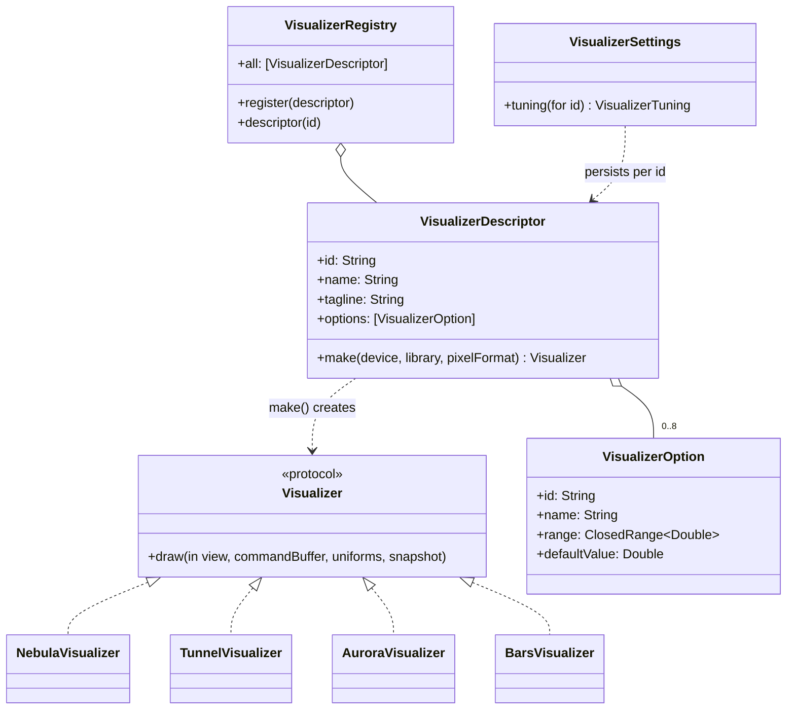
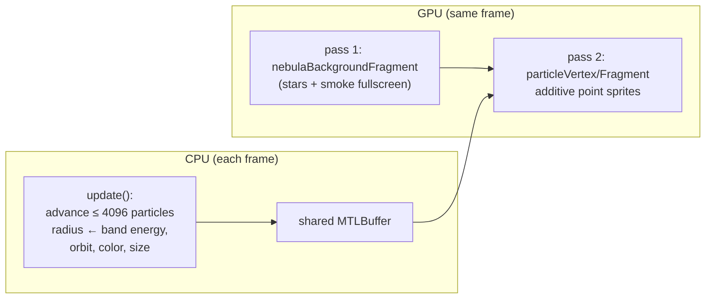
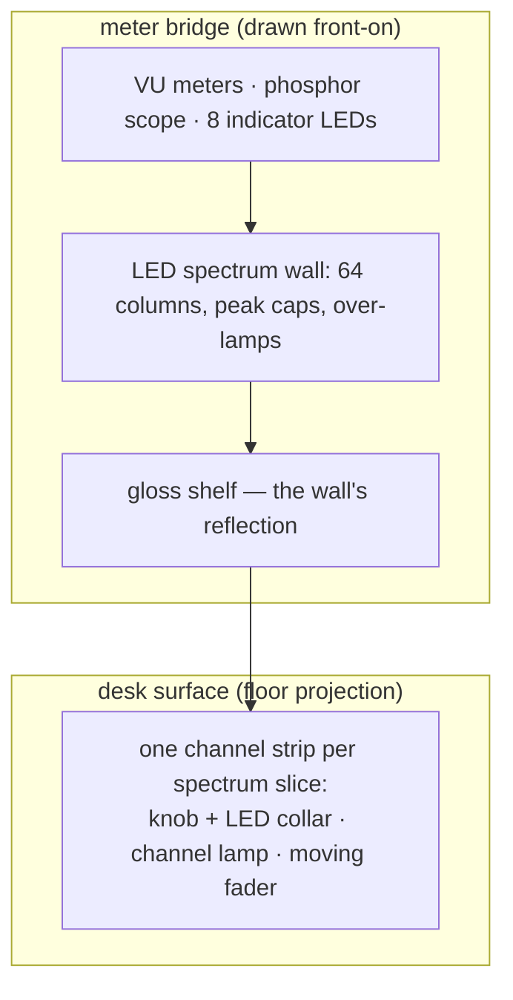

# Visualizers

Visualizers are Synesthia's plugin system: self-contained modules that turn
the shared audio analysis into imagery. This document explains the contract,
walks through the four built-ins, and shows how to add a new one.
Code: `Synesthia/Visualizers/`.

## The plugin contract



Two pieces, deliberately separated:

- **`VisualizerDescriptor`** — a cheap static _value_: identity, UI strings,
  up to eight option sliders, and a factory closure. Descriptors for every
  visualizer exist all the time (they populate menus).
- **The `Visualizer` class** — the expensive _instance_ holding GPU
  pipelines and buffers. Only the selected one exists; it's built by
  `descriptor.make` when chosen and deallocated when switched away.

The runtime contract is a single method: once per frame,

```swift
func draw(in view: MTKView, commandBuffer: MTLCommandBuffer,
          uniforms: VizUniforms, snapshot: AudioSnapshot)
```

encode whatever GPU work you like into `commandBuffer`. The host has already
assembled `uniforms` (audio features + clock + user tuning + your option
values in `p0…p7`) and hands you the full `snapshot` for bulk data (64-band
spectrum, 256-point waveform).

**Everything else is automatic.** Declare options in the descriptor and they
appear in the Options popover, arrive in `p0…p7` in declaration order, and
persist per-visualizer (`VisualizerSettings` keys tunings by descriptor id —
switching visualizers restores each one's own look, including its palette).

## How the audio maps to visuals

All four built-ins follow the same philosophy — _different registers drive
different elements_, so the picture decomposes the music rather than just
pulsing with loudness:

| Audio feature               | Nebula                       | Spectrum Tunnel                 | Aurora                         | Bars                           |
| --------------------------- | ---------------------------- | ------------------------------- | ------------------------------ | ------------------------------ |
| `bands[64]`                 | one band per particle        | tunnel wall brightness by angle | ribbon glow by height          | column height + peak-hold caps |
| `waveform[256]`             | —                            | —                               | ribbon displacement            | the scope's trace              |
| `level` (RMS)               | —                            | scene exposure                  | —                              | the program VU needle          |
| `beat` (kick)               | core particles surge         | forward lurch + center flash    | scene brightness lift          | console lamp + VU backlights   |
| `trebleBeat` (hi-hat)       | outer particles flicker      | glints at tunnel mouth          | sparkle field                  | —                              |
| `flux` (any onset)          | swirl speeds up, core flares | whole scene lifts               | shimmer                        | console lamp                   |
| `centroid` (brightness)     | hue shift                    | hue shift                       | hue shift                      | hue shift                      |
| sub-bands (`subBass`…`air`) | mid-particle flicker         | camera sway, spokes, fine rings | fog, haze, stars, rays, ripple | the bay's eight indicator LEDs |

### Spectrum Tunnel (`TunnelVisualizer` + `tunnelFragment`)

Pure fullscreen shader; the Swift class is ~40 lines of pipeline setup. The
shader sphere-traces a real 3D signed-distance field: a bore of varying
radius around a centerline that snakes through space, so bends genuinely
occlude and the far end is never visible. Each angular lane of the wall
reads one spectrum band (bass at the floor, treble overhead, mirror-folded
so there is no seam) and loud bands bulge the rock inward; crevice lighting
comes free from the march's iteration count, and volumetric steam, kick
light-walls, and audio-pumped exposure are layered on top, each tied to its
own audio feature.

### Aurora (`AuroraVisualizer` + `auroraFragment`)

Also a pure fullscreen shader, and the only consumer of the waveform. A
night-sky scene is built in layers (gradient, stars, haze, fog), then N
horizontal ribbons are drawn; ribbon _i_ is displaced vertically by the
waveform and brightened by its own slice of the spectrum — lows at the
bottom, highs at the top.

### Nebula (`NebulaVisualizer` + three shader functions)

The hybrid: a CPU particle simulation over a shader background.



Each particle permanently listens to one of the 64 bands (dealt
round-robin), lives on a ray from the origin, and eases its distance toward
a target set by its band's energy — hits fling particles outward, silence
lets them drift back. Bass particles form a slow heavy core, treble
particles sparkle out wide. The CPU writes position+color into a
`.storageModeShared` buffer (one memory region visible to both CPU and GPU
on Apple silicon), and the GPU draws them as additively-blended glowing
dots.

### Bars (`BarsVisualizer` + `barsFragment`)

A mixing console seen from the producer's chair, drawn as one fullscreen pass
of signed-distance fields — no particles and no raymarching, so each pixel
only evaluates the widgets of the zone it lands in.



Two things make it different from the other three:

- **The console's physics runs on the CPU.** Everything a meter does with a
  _time constant_ needs memory between frames, which a fragment shader has
  none of: attack/release ballistics per column, peak caps that hang and then
  accelerate downward, motorized-fader lag, multi-second knob drift, and the
  damped-spring integration that gives the VU needles their overshoot (the
  left needle is a true ~300 ms VU ballistic, the right a 50 ms peak meter
  with a slow return). The result is one small float array — see
  `BarsVisualizer.Slot`, mirrored by the `kBars…` constants in Shaders.metal —
  bound at `buffer(3)`. **The shader reads no audio at all**; it draws state.
- **Everything is measured in screen-height units**, so a lens or a knob keeps
  its shape at any window aspect: `uv` is 0…1 on both axes, so a y distance is
  already in height units and an x distance becomes one by multiplying by the
  aspect ratio. One pixel is then a single `aa` value shared by every edge.

The desk is a textbook floor projection: a fixed world width appears `dy`
wide on screen, where `dy` is the distance below the horizon, so world x is
`(screen x)/dy` and world depth is `1/dy`. Widgets are laid out in those world
coordinates and foreshorten for free. Their anti-aliasing width is
differentiated analytically rather than with `fwidth()`, which would be
undefined in the pixel quads straddling the horizon.

Bars also finishes differently: vibrance, then `1 - exp(-x)` instead of the
Reinhard + S-curve chain the others end with. Those visualizers are additive
glow on black, where the S-curve's midtone crush is what keeps them from
looking milky; this one is lit hardware, and the same curve would swallow the
panel, the desk, and every unlit lens.

## Adding a visualizer, step by step

1. **Write the shader(s).** Add your MSL functions to `Shaders.metal`
   (compiled at build time, so errors surface in the build log). For a
   Shadertoy-style visualizer you only need a fragment function — reuse
   `fullscreenVertex`, `cosPalette`, `bandAt`, `waveAt`, and the noise
   helpers.

2. **Write the class.** Model it on `TunnelVisualizer` — build pipelines in
   `init` via `makeRenderPipeline`, encode one pass in `draw`:

   ```swift
   final class RippleVisualizer: Visualizer {
       static let descriptor = VisualizerDescriptor(
           id: "ripple",
           name: "Ripple",
           tagline: "Rings that spread from every beat",
           options: [
               VisualizerOption(id: "count", name: "Rings",
                                range: 1...12, defaultValue: 6),
           ],
           make: { try RippleVisualizer(device: $0, library: $1, pixelFormat: $2) })

       private let pipeline: MTLRenderPipelineState

       init(device: MTLDevice, library: MTLLibrary, pixelFormat: MTLPixelFormat) throws {
           pipeline = try makeRenderPipeline(
               device: device, library: library,
               vertex: "fullscreenVertex", fragment: "rippleFragment",
               pixelFormat: pixelFormat)
       }

       func draw(in view: MTKView, commandBuffer: MTLCommandBuffer,
                 uniforms: VizUniforms, snapshot: AudioSnapshot) {
           guard let pass = view.currentRenderPassDescriptor,
                 let encoder = commandBuffer.makeRenderCommandEncoder(descriptor: pass) else { return }
           var u = uniforms   // "count" arrives as u.p0
           encoder.setRenderPipelineState(pipeline)
           encoder.setFragmentBytes(&u, length: MemoryLayout<VizUniforms>.stride, index: 0)
           snapshot.bands.withUnsafeBytes {
               encoder.setFragmentBytes($0.baseAddress!, length: $0.count, index: 1)
           }
           encoder.drawPrimitives(type: .triangle, vertexStart: 0, vertexCount: 3)
           encoder.endEncoding()
       }
   }
   ```

3. **Register it.** Add `RippleVisualizer.descriptor` to the array in
   `VisualizerRegistry.all` (or call `VisualizerRegistry.register(_:)` at
   startup — the hook a future external-bundle loader would use).

That's the whole job: create the file anywhere under `Synesthia/` (the Xcode
project auto-includes it — don't edit `project.pbxproj`), and the picker
menu, ⌘-number shortcut, options UI, and settings persistence all follow
from the descriptor.

### Ground rules

- **≤ 8 options** — only `p0…p7` reach the shader.
- **Scale motion by `uniforms.speed`, response by `uniforms.sensitivity`,
  and color through `cosPalette(t, u.palette)`** so the shared controls
  behave consistently across visualizers.
- **Use envelopes, not raw energy, for accents** — `beat`, `trebleBeat`,
  and `flux` already decay smoothly; multiplying by them gives clean pulses.
- **End fullscreen shaders with tone mapping** (`col / (1.0 + col)`) if you
  accumulate brightness additively.
- **Keep `draw` allocation-light** — it runs 60× per second on the main
  thread. Allocate buffers in `init`.
