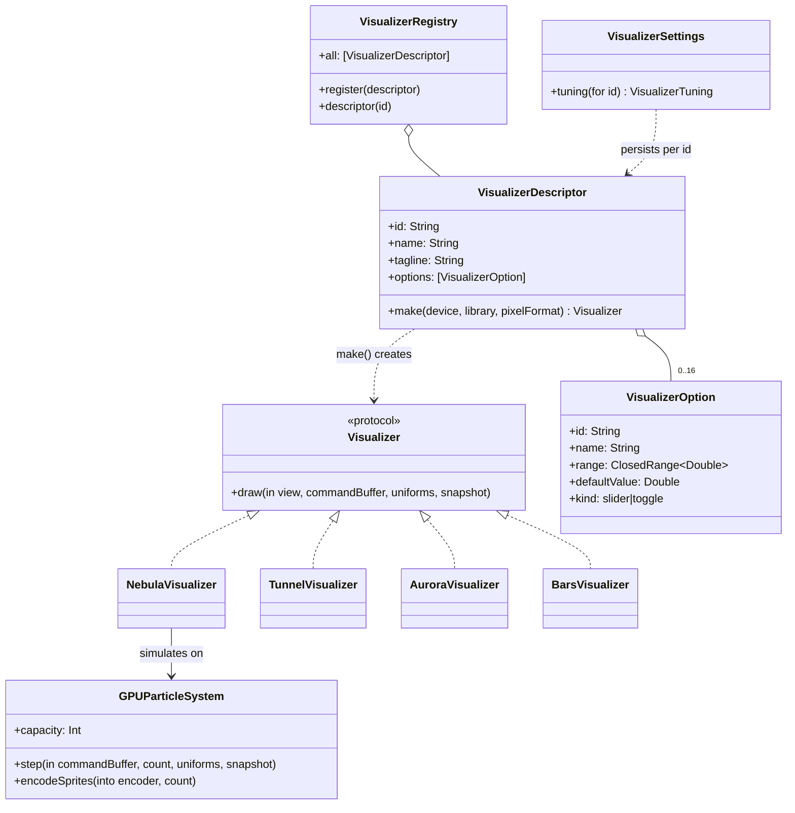
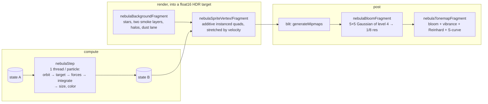
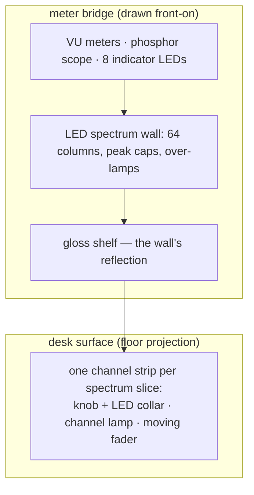

# Visualizers

Visualizers are Synesthia's plugin system: self-contained modules that turn
the shared audio analysis into imagery. This document explains the contract,
walks through the four built-ins, and shows how to add a new one.
Code: `Synesthia/Visualizers/`.

## The plugin contract



Two pieces, deliberately separated:

- **`VisualizerDescriptor`** — a cheap static _value_: identity, UI strings,
  up to sixteen options, and a factory closure. Descriptors for every
  visualizer exist all the time (they populate menus).
- **The `Visualizer` class** — the expensive _instance_ holding GPU
  pipelines and buffers. Only the selected one exists; it's built by
  `descriptor.make` when chosen and deallocated when switched away.

The runtime contract is a single method: once per frame,

```swift
func draw(in view: MTKView, commandBuffer: MTLCommandBuffer,
          uniforms: VizUniforms, snapshot: AudioSnapshot)
```

encode whatever GPU work you like into `commandBuffer`. The host has already
assembled `uniforms` (audio features + clock + user tuning + your option
values in `p[0…15]`) and hands you the full `snapshot` for bulk data (64-band
spectrum, 256-point waveform).

**Everything else is automatic.** Declare options in the descriptor and they
appear in the Options popover, arrive in the shader's `p` array at the slot each
one names, and persist per-visualizer (`VisualizerSettings` keys tunings by
descriptor id — switching visualizers restores each one's own look, including
its palette). An option is a slider unless you build it with
`.toggle(id:name:defaultOn:slot:)`, which draws a switch and delivers 0 or 1 in
the same slot — test it with `> 0.5` in the shader.

There are `VizUniforms.parameterCount` (16) slots, and **every option declares
which one it lands in**. Name the same numbers at the top of your shader section
rather than indexing by hand:

```metal
constant int kNebulaTurbulence = 3;   // …then u.p[kNebulaTurbulence]
```

```swift
VisualizerOption(id: "turbulence", name: "Turbulence",
                 range: 0.0...2.5, defaultValue: 1.0, slot: 3)
```

`slot` has no default, so a new option cannot silently collide with an existing
one — the compiler asks. It used to be inferred from the option's position in
the array, which meant reordering the popover remapped every shader constant for
that visualizer with no build error and no test failure. Two tests in
`VizUniformsTests` now pin the Swift slots against the MSL table; the table in
`optionSlotsMatchTheShaderConstants` is hand-transcribed from `Shaders.metal` on
purpose, so don't rewrite it in terms of the descriptors.

The uniform block also carries **per-frame state the host derives once**, so no
visualizer has to keep it itself:

| Field                   | What it is                                             |
| ----------------------- | ------------------------------------------------------ |
| `beatHit` / `trebleHit` | 1 on the frame a kick / hi-hat _landed_, 0 otherwise   |
| `beatCount`             | kicks since launch — a clock that ticks with the music |
| `frame`                 | frames since launch, for per-frame hashes              |
| `reduceMotion`          | 1 when the system setting is on (see the ground rules) |
| `intro`                 | 0 → 1 ramp after this visualizer was built             |

`beatHit`/`trebleHit` are the ones that matter for simulations. `beat` and
`trebleBeat` are envelopes that decay smoothly, so a shader can see
"loud-ish" but never "a kick landed on _this_ frame" — and an impulse has to be
applied on exactly one frame or it either misfires or applies forever. Spotting
the rising edge needs the previous frame's value, which the host has and a GPU
kernel does not.

## How the audio maps to visuals

All four built-ins follow the same philosophy — _different registers drive
different elements_, so the picture decomposes the music rather than just
pulsing with loudness:

| Audio feature               | Nebula                                        | Spectrum Tunnel                 | Aurora                         | Bars                           |
| --------------------------- | --------------------------------------------- | ------------------------------- | ------------------------------ | ------------------------------ |
| `bands[64]`                 | one band per particle (~1.5k each)            | tunnel wall brightness by angle | ribbon glow by height          | column height + peak-hold caps |
| `waveform[256]`             | the oscilloscope ring                         | —                               | ribbon displacement            | the scope's trace              |
| `level` (RMS)               | the oscilloscope ring's fade                  | scene exposure                  | —                              | the program VU needle          |
| `beat` (kick)               | core surges + shockwave front                 | forward lurch + center flash    | scene brightness lift          | console lamp + VU backlights   |
| `trebleBeat` (hi-hat)       | comet flings from the halo                    | glints at tunnel mouth          | sparkle field                  | —                              |
| `flux` (any onset)          | turbulence opens up                           | whole scene lifts               | shimmer                        | console lamp                   |
| `centroid` (brightness)     | hue shift                                     | hue shift                       | hue shift                      | hue shift                      |
| sub-bands (`subBass`…`air`) | flicker, turbulence scroll, background layers | camera sway, spokes, fine rings | fog, haze, stars, rays, ripple | the bay's eight indicator LEDs |

### Spectrum Tunnel (`TunnelVisualizer` + `tunnelFragment`)

Pure fullscreen shader; the Swift class is ~40 lines of pipeline setup. The
shader sphere-traces a real 3D signed-distance field: a bore of varying
radius around a centerline that snakes through space, so bends genuinely
occlude and the far end is never visible. Each angular lane of the wall
reads one spectrum band (bass at the floor, treble overhead, mirror-folded
so there is no seam) and loud bands bulge the rock inward; crevice lighting
comes free from the march's iteration count, and volumetric steam, kick
light-walls, and audio-pumped exposure are layered on top, each tied to its
own audio feature.

### Aurora (`AuroraVisualizer` + `auroraFragment`)

Also a pure fullscreen shader, and the only consumer of the waveform. A
night-sky scene is built in layers (gradient, stars, haze, fog), then N
horizontal ribbons are drawn; ribbon _i_ is displaced vertically by the
waveform and brightened by its own slice of the spectrum — lows at the
bottom, highs at the top.

### Nebula (`NebulaVisualizer` + `GPUParticleSystem` + two kernels and five shader functions)

The compute one: up to 131,072 particles simulated entirely on the GPU, drawn
over a shader background. The CPU encodes a dispatch and touches no particle
data — the buffers are `.storageModePrivate`, so it _can't_.



Each particle permanently listens to one of the 64 bands (dealt round-robin by
index, so _any_ prefix of the buffer still covers the whole spectrum evenly) and
belongs to one of three bodies: bass bands form a tight pulsing core, mids a
flattened galaxy disc with differential rotation, treble a spherical halo that
throws comets on hi-hat transients.

The simulation is **force-based**, which is the part that matters. The body's
shape gives every particle a _target position_ from its band's energy; a spring
pulls it there while three things push it off:

- **Divergence-free turbulence**, opened up by the mids and any onset — the
  effect a CPU loop could never have afforded, and what makes the cloud look
  alive between hits. See [rendering.md](rendering.md#drawing-techniques-used)
  for why incompressibility is the requirement rather than a nicety.
- **Comet impulses** on `trebleHit`, flung by a hashed ~30% of the halo.
- **The kick shockwave**, whose front is `(1 - beat) × 3` — derived from the
  decaying envelope rather than integrated, so it needs no state _and_ is
  literally the same wave the background's ring draws. Those two used to be
  separate constructions that merely resembled each other.

So the shapes stay legible while the motion between them becomes weather. Color
is layered the same way: hue comes from the particle's band (the spectrum laid
out across the cloud), plus a per-body offset (so core, disc and halo read as
three materials rather than one gradient), plus its own speed (motion as visible
iridescence). Energy pushes _saturation and exposure_ up rather than mixing
toward white — brightness belongs in the magnitude, and the HDR tonemap turns a
hot enough color white by itself. Only `heat` (comet flares, the shockwave
front) goes deliberately white-hot.

Depth is sold twice over in the vertex shader, both off the perspective factor:
far particles run cooler and dimmer (atmospheric perspective), while near ones
grow _and dim_, because a defocused sprite spreads a fixed amount of light over
a larger area. Without that second half, any particle swinging past the camera
becomes a solid disc over a third of the frame.

### Bars (`BarsVisualizer` + `barsFragment`)

A mixing console seen from the producer's chair, drawn as one fullscreen pass
of signed-distance fields — no particles and no raymarching, so each pixel
only evaluates the widgets of the zone it lands in.



Two things make it different from the other three:

- **The console's physics runs on the CPU.** Everything a meter does with a
  _time constant_ needs memory between frames, which a fragment shader has
  none of: attack/release ballistics per column, peak caps that hang and then
  accelerate downward, motorized-fader lag, multi-second knob drift, and the
  damped-spring integration that gives the VU needles their overshoot (the
  left needle is a true ~300 ms VU ballistic, the right a 50 ms peak meter
  with a slow return). The result is one small float array — see
  `BarsVisualizer.Slot`, mirrored by the `kBars…` constants in Shaders.metal —
  bound at `buffer(3)`. **The shader reads no audio at all**; it draws state.
- **Everything is measured in screen-height units**, so a lens or a knob keeps
  its shape at any window aspect: `uv` is 0…1 on both axes, so a y distance is
  already in height units and an x distance becomes one by multiplying by the
  aspect ratio. One pixel is then a single `aa` value shared by every edge.

The desk is a textbook floor projection: a fixed world width appears `dy`
wide on screen, where `dy` is the distance below the horizon, so world x is
`(screen x)/dy` and world depth is `1/dy`. Widgets are laid out in those world
coordinates and foreshorten for free. Their anti-aliasing width is
differentiated analytically rather than with `fwidth()`, which would be
undefined in the pixel quads straddling the horizon.

Bars also finishes differently: vibrance, then `1 - exp(-x)` instead of the
Reinhard + S-curve chain the others end with. Those visualizers are additive
glow on black, where the S-curve's midtone crush is what keeps them from
looking milky; this one is lit hardware, and the same curve would swallow the
panel, the desk, and every unlit lens.

## Adding a visualizer, step by step

1. **Write the shader(s).** Add your MSL functions to `Shaders.metal`
   (compiled at build time, so errors surface in the build log). For a
   Shadertoy-style visualizer you only need a fragment function — reuse
   `fullscreenVertex`, `cosPalette`, `bandAt`, `waveAt`, and the noise
   helpers. For a simulation, write a `kernel` pair instead and read
   `nebulaSeed`/`nebulaStep` first: `GPUParticleSystem` will run them for you,
   and the buffer indices it binds are fixed
   (see [rendering.md](rendering.md#gpu-compute-simulation-without-the-cpu)).

2. **Write the class.** Model it on `TunnelVisualizer` — build pipelines in
   `init` via `makeRenderPipeline`, encode one pass in `draw`:

   ```swift
   final class RippleVisualizer: Visualizer {
       static let descriptor = VisualizerDescriptor(
           id: "ripple",
           name: "Ripple",
           tagline: "Rings that spread from every beat",
           options: [
               VisualizerOption(id: "count", name: "Rings",
                                range: 1...12, defaultValue: 6),
           ],
           make: { try RippleVisualizer(device: $0, library: $1, pixelFormat: $2) })

       private let pipeline: MTLRenderPipelineState

       init(device: MTLDevice, library: MTLLibrary, pixelFormat: MTLPixelFormat) throws {
           pipeline = try makeRenderPipeline(
               device: device, library: library,
               vertex: "fullscreenVertex", fragment: "rippleFragment",
               pixelFormat: pixelFormat)
       }

       func draw(in view: MTKView, commandBuffer: MTLCommandBuffer,
                 uniforms: VizUniforms, snapshot: AudioSnapshot) {
           guard let pass = view.currentRenderPassDescriptor,
                 let encoder = commandBuffer.makeRenderCommandEncoder(descriptor: pass) else { return }
           var u = uniforms   // "count" arrives as u.p0
           encoder.setRenderPipelineState(pipeline)
           encoder.setFragmentBytes(&u, length: MemoryLayout<VizUniforms>.stride, index: 0)
           snapshot.bands.withUnsafeBytes {
               encoder.setFragmentBytes($0.baseAddress!, length: $0.count, index: 1)
           }
           encoder.drawPrimitives(type: .triangle, vertexStart: 0, vertexCount: 3)
           encoder.endEncoding()
       }
   }
   ```

3. **Register it.** Add `RippleVisualizer.descriptor` to the array in
   `VisualizerRegistry.all` (or call `VisualizerRegistry.register(_:)` at
   startup — the hook a future external-bundle loader would use).

That's the whole job: create the file anywhere under `Synesthia/` (the Xcode
project auto-includes it — don't edit `project.pbxproj`), and the picker
menu, ⌘-number shortcut, options UI, and settings persistence all follow
from the descriptor.

### Ground rules

- **≤ `VizUniforms.parameterCount` options** (16) — only those slots reach the
  shader, and a descriptor that declares more silently loses the extras (there
  is a debug assertion, and a test that every registered visualizer fits).
- **Every option names its `slot`, and no two share one.** Both are debug
  assertions in `VisualizerDescriptor.init` and tests in `VizUniformsTests`.
  Never renumber a slot to tidy things up: tunings persist by option _id_, so
  persistence survives, but the shader reads by slot — a renumber moves a
  user's stored value onto a different constant on their next launch.
- **Scale motion by `uniforms.speed`, response by `uniforms.sensitivity`,
  and color through `cosPalette(t, u.palette)`** so the shared controls
  behave consistently across visualizers.
- **Use envelopes, not raw energy, for accents** — `beat`, `trebleBeat`,
  and `flux` already decay smoothly; multiplying by them gives clean pulses.
  Use `beatHit`/`trebleHit` when you need the _event_ rather than the envelope.
- **Honor `reduceMotion`** for anything the host's damping can't reach. It
  softens the transient features and the clock, which covers most visualizers;
  an effect with no audio feature behind it — turbulence, a strobe, an
  auto-rotate — has to check the flag and tone itself down.
- **End fullscreen shaders with tone mapping** (`col / (1.0 + col)`) if you
  accumulate brightness additively.
- **Keep `draw` allocation-light** — it runs 60× per second on the main
  thread. Allocate buffers and pipelines in `init`.
- **Simulate on the GPU, not in `draw`.** Anything per-element and parallel
  belongs in a compute kernel; `GPUParticleSystem` already has the buffers, the
  ping-pong, and the dispatch. A CPU loop in `draw` spends main-thread time
  inside the frame and caps out a couple of orders of magnitude earlier. State
  with a _time constant_ but no parallelism (Bars' meter ballistics) is the
  exception that stays on the CPU.
